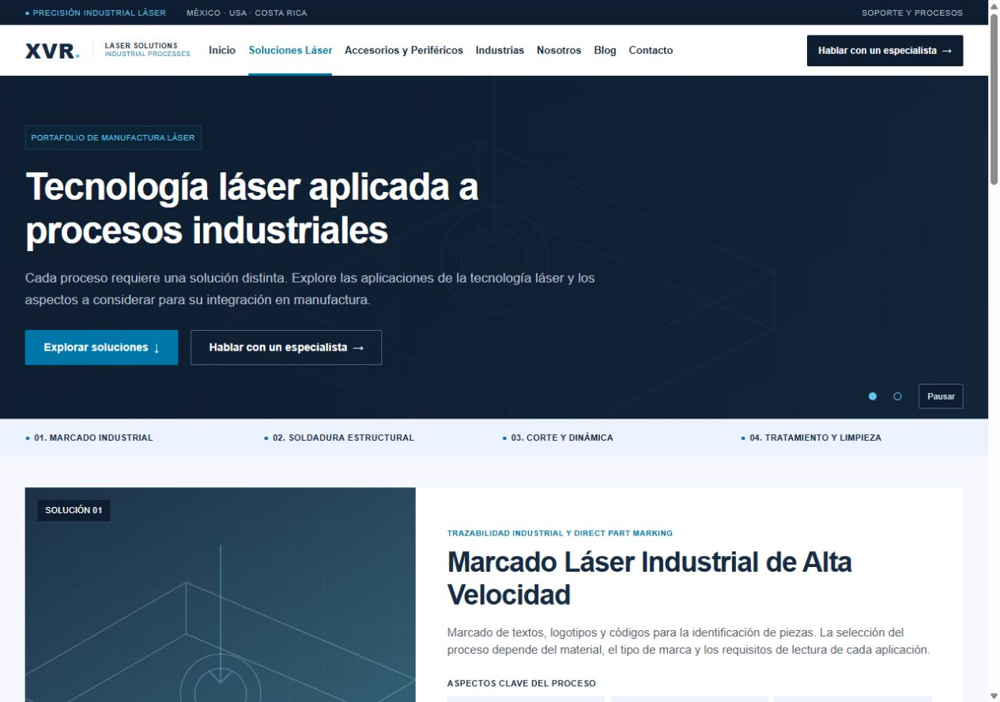
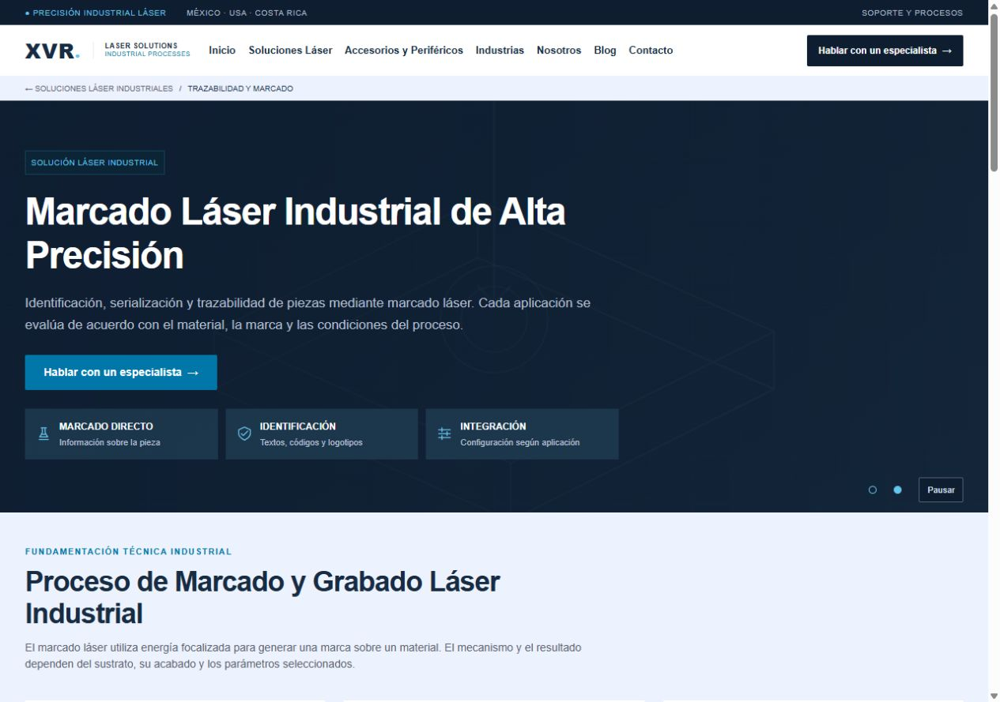

# XVR — Fase 2

Implementación sobre el proyecto existente. Sin dependencias nuevas, reinicialización, operaciones Git, backend, formularios, Odoo ni páginas adicionales.

## Estructura y archivos

Nuevos:

```text
src/data/solutionsData.js
src/pages/Solutions/Solutions.jsx
src/pages/SolutionDetail/SolutionDetail.jsx
src/styles/solutions.css
public/images/hero/solutions/
  portafolio-placeholder.svg
  procesos-placeholder.svg
  marking/
    identificacion-placeholder.svg
    trazabilidad-placeholder.svg
public/images/solutions/marking/
  applications/
    vin-placeholder.svg
    dispositivos-placeholder.svg
    codigos-placeholder.svg
    placas-placeholder.svg
  ecosystem/
    fuentes-placeholder.svg
    cabezales-placeholder.svg
    extraccion-placeholder.svg
docs/PHASE-2.md
docs/screenshots/phase-2-soluciones-desktop.jpg
docs/screenshots/phase-2-marcado-desktop.jpg
```

Modificados:

- `src/App.jsx`: conexión de páginas, registro de detalles a partir de los datos y título del documento por ruta.
- `src/routes/paths.js`: Blog antes de Contacto, ruta `/blog`.
- `src/components/HeroCarousel/HeroCarousel.jsx`: props opcionales `className` y `ariaLabel`. Los valores predeterminados mantienen el Home existente.
- `src/styles/variables.css`: altura del Header y tokens de interacción.
- `src/styles/globals.css`: Header sticky, compensación de anchors, espacio para Blog, menú desplazable en pantallas bajas y estados de cards.
- `README.md`: enlace al estado y documentación actuales.

No se modificaron Home.jsx, homeData.js, Header.jsx, Footer.jsx, CTASection.jsx, SolutionCard.jsx, IndustryCard.jsx, PartnerLogo.jsx, main.jsx, package.json ni package-lock.json. Los cambios globales de navegación y cards se aplican desde sus datos/estilos existentes.

## Rutas

Implementadas: `/`, `/soluciones`, `/soluciones/marcado-laser`.

Reservadas mediante el PendingRoute existente:

- `/soluciones/soldadura-laser`
- `/soluciones/corte-microprocesos`
- `/soluciones/tratamiento-superficial`
- `/accesorios-perifericos`
- `/contacto`
- `/blog`

La reserva dinámica `/soluciones/:slug` se mantiene como antes. `/#industrias` y `/#nosotros` regresan al Home. El portafolio incorpora navegación a sus cuatro bloques mediante hashes. En un despliegue posterior se requiere fallback SPA a index.html.

## Reutilización

Header y Footer siguen montados una sola vez en App. HeroCarousel conserva autoplay, pausa, selección manual y movimiento reducido. CTASection se reutiliza sin modificar su implementación: las variantes visuales usan selectores limitados a las páginas nuevas. Icon se reutiliza en las cards informativas.

Solutions es la nueva página de portafolio. SolutionDetail es el nuevo template, sin textos particulares de Marcado dentro del JSX. Recibe `solution`, que contiene slug, título, descripción, imágenes, highlights, process, applications, benefits, industries, ecosystem y cta.

Para agregar un detalle en una fase futura, añadir su entrada completa a `solutionDetails` en solutionsData.js; App registra la ruta y usa el template automáticamente. No hace falta copiar la página. Las colecciones internas admiten un número variable de cards. El orden de secciones sigue la referencia aprobada.

## Home y accesibilidad

Contenido, estructura y secciones de Home permanecen intactos. Los únicos cambios visuales globales son:

- Blog en Header.
- Header completo, incluida barra corporativa, con `position: sticky; top: 0` y fondo sólido. Mantiene su espacio normal, sin desplazamientos de layout.
- Hover de 200 ms, elevación de 3 px y sombra en SolutionCard, IndustryCard y PartnerLogo. SolutionCard resalta cuando su enlace recibe `:focus-visible`, además del outline del enlace.

IndustryCard y PartnerLogo siguen siendo informativos y no tienen destinos. No se agregan enlaces ficticios, cursor pointer ni tabIndex. Sus reglas `:has(:focus-visible)` quedan disponibles si en otra fase incorporan un enlace real. El hover funciona sobre el contenedor tanto con nombre provisional como con imagen de logo.

Con `prefers-reduced-motion: reduce`, se desactivan la transición y la elevación; se mantiene la señal visual de sombra/borde. El carrusel conserva su lógica previa de desactivar autoplay/transición.

## Contenido provisional y diferencias visuales

- Las fotos son placeholders SVG locales identificados. No se descargaron assets, fuentes ni logos externos.
- Los dos heroes usan carrusel de fondo con overlay oscuro, contenido fijo y controles discretos. Esto sustituye el Hero claro/imagen lateral de las referencias conforme al requisito explícito.
- La paleta, fuente de sistema y componentes globales proceden de Fase 1. Los botones oscuros usan el azul marino existente, no una paleta paralela.
- Se mantienen composición del portafolio (imagen izquierda, descripción derecha y tres aspectos por solución), orden de secciones y grids del detalle. En tablet/móvil los grids se reducen progresivamente.
- Títulos y categorías se conservan según el encargo. Descripciones, highlights y metadatos técnicos son contenido editorial general pendiente de aprobación, centralizado en solutionsData.js. No se publican cifras de velocidad, tolerancias, normas, longitudes de onda, MTBF, garantías o capacidades de laboratorio de las referencias.
- Las tablas de parámetros se sustituyen por breves notas de evaluación. Las cards permanecen concisas e informativas.
- Se omite el botón de solicitud de prueba con muestra, ya que no existe ese flujo ni se autorizó un formulario. El Hero dirige a Contacto; cada bloque del portafolio tiene solamente un CTA, Conocer solución.
- El CTA de Marcado usa los textos solicitados y enlaza a Contacto. No se incluye teléfono sin confirmar.
- Header/Footer se conservan globales con sus datos editoriales heredados de Fase 1. No se añadieron afirmaciones técnicas a esos componentes.

## Sustitución de assets

Las cuatro imágenes existentes de `public/images/solutions/*-placeholder.svg` también se reutilizan en el portafolio. Sustituirlas por fotografías reales y actualizar `solutionPortfolio[].image` en solutionsData.js; Home mantiene sus rutas independientes en homeData.js.

Los once SVG nuevos listados arriba deben reemplazarse por:

- Dos fotografías panorámicas para el Hero del portafolio.
- Dos fotografías panorámicas de marcado para el Hero del detalle.
- Cuatro fotografías de aplicaciones: VIN, dispositivos, códigos y placas.
- Tres fotografías de componentes: fuentes, cabezales y extracción/enfriamiento.

Todos los destinos de Fase 2 están en solutionsData.js. Agregar el archivo local y cambiar su ruta no requiere modificar componentes. Las cards de imágenes admiten `alt`; para imágenes decorativas que repiten el título, se usa alt vacío. Las imágenes de fondo del Hero son decorativas y quedan ocultas para tecnologías de asistencia.

## Validación

Validación realizada el 30 de septiembre de 2026:

- `npm run build`: correcto, Vite 7.3.6, 57 módulos. El sandbox bloqueó inicialmente esbuild con `spawn EPERM`; la ejecución autorizada fuera del sandbox pasó.
- Consola del navegador local: sin errores o advertencias relevantes durante la revisión.
- Se comprobaron Home, Soluciones y Marcado en 320, 390, 768, 1024, 1101, 1280 y 1440 px: 21 combinaciones, todas sin overflow horizontal (`scrollWidth <= clientWidth`) y con un único h1.
- Sin imágenes cargadas rotas. Se verificó además la carga diferida de las tres imágenes del ecosistema al desplazarse hacia el final del detalle.
- Revisiones visuales de desktop, tablet y móvil: heroes, bloques del portafolio, cards, CTA, Footer y menú.
- Header sticky verificado en scroll real, con `getBoundingClientRect().top === 0`; alturas de 97 px desktop/tablet y 100 px móvil.
- Anchors: Nosotros desde Contacto y Industrias desde Blog móvil regresan al Home. El inicio de sección queda debajo del Header (aproximadamente 121 px desktop y 124 px móvil, frente a Header de 97/100 px).
- Índice del portafolio probado con Marcado y Corte: conserva hash y compensación sticky.
- Blog comprobado en desktop y móvil: usa el mismo aviso reservado. Menú móvil cierra al navegar y con Escape; Escape devuelve el foco al botón.
- Hover real comprobado en SolutionCard, IndustryCard y PartnerLogo: elevación de 3 px y sombra. SolutionCard también cambia el borde. Duración computada: 0.2 s.
- Navegación con teclado: enlace de SolutionCard con `:focus-visible`, outline sólido y estado del contenedor activo. Industrias/partners no adquirieron tab stops artificiales.
- Portafolio → Marcado y breadcrumb Marcado → Portafolio verificados.
- Los tres CTAs de detalles futuros abren su ruta reservada, sin contenido de otra fase.
- CTA final de Marcado → Contacto verificado, con aviso reservado.
- Ambos carruseles: avance automático observado con título fijo, selección manual y pausa/reanudación. El portafolio conservó la imagen seleccionada durante la pausa.
- Revisión de código de movimiento reducido: se conservan la escucha de media query, el bloqueo de autoplay y las transiciones desactivadas; los nuevos hover desactivan también desplazamiento.
- SHA-256 de Home.jsx, homeData.js, Footer.jsx, CTASection.jsx, package.json y package-lock.json idénticos a la inspección inicial.
- No se ejecutaron comandos Git ni se instalaron dependencias.

Límites: no se emuló `prefers-reduced-motion` en navegador, no se realizó auditoría integral con lector de pantalla ni prueba entre motores. La fidelidad fotográfica queda pendiente de assets definitivos. Los datos editoriales de Fase 2 requieren aprobación de XVR. No existe script de lint o suite de tests configurada en package.json; no se añadieron herramientas externas para esta fase. No se publicó el sitio.

Capturas:




